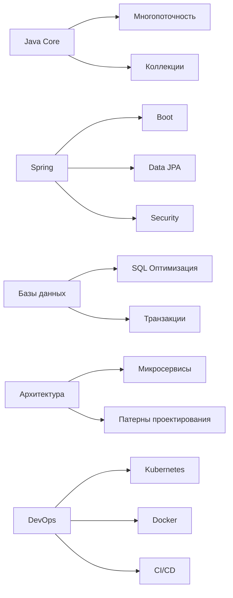

# 👋 Привет! Я Марат Магомедов 
### Middle Java Developer | Инженер-программист | Ярославль
```java
public class Main {
    public static void main(String[] args) {
        Developer marat = new Developer.Builder()
            .name("Магомедов Марат Мурадович")
            .age(23)
            .location("Ярославль")
            .education("ЯГТУ, Программная инженерия")
            .level("Middle Java Developer")
            .build();
        
        System.out.println("Добро пожаловать в мой профиль!");
    }
}
```
## 🧑‍💻 Обо мне
```diff
+ Выпускник Ярославского Государственного Технического Университета (ЯГТУ)
+ Специальность: 09.03.04 "Программная инженерия"
+ Проживаю и работаю в Ярославле
+ Сфокусирован на backend-разработке и распределённых системах
```
## 🛠️ Технологический стек
### Основные технологии
| Категория       | Технологии                                                                 |
|-----------------|----------------------------------------------------------------------------|
| **Языки**       | `Java 11+`, `SQL`                                                          |
| **Фреймворки**  | `Spring Boot`, `Spring MVC`, `Spring Data`, `Spring Cloud`, `Hibernate`    |
| **Тестирование**| `JUnit 5`, `Mockito`, `Testcontainers`                                     |
| **Базы данных** | `PostgreSQL`, `MySQL`, `Liquibase` (миграции)                             |
| **Инфраструктура**| `Docker`, `Kubernetes`, `Helm`, `Kafka`, `RabbitMQ`                      |
| **Методологии** | `REST API`, `Микросервисная архитектура`, `Event-Driven Design`           |
### Ключевые навыки

## 📚 Образование
**🎓 Ярославский Государственный Технический Университет (ЯГТУ)**  
Специальность: 09.03.04 "Программная инженерия"  
Годы обучения: 2021-2025  
Квалификация: Бакалавр  
**Ключевые дисциплины:**
- Алгоритмы и структуры данных
- Проектирование ПО
- Базы данных
- Распределённые системы
- Тестирование ПО
## 🔥 Мои сильные стороны
```diff
+ Глубокое понимание алгоритмов и структур данных
+ Опыт проектирования и реализации REST API
+ Практические навыки работы с микросервисной архитектурой
+ Умение проектировать и оптимизировать реляционные БД
+ Опыт контейнеризации приложений и оркестрации
+ Знание принципов event-driven архитектуры
+ Навыки работы с системами потоковой обработки данных
```
## 🚀 Проектный опыт
### Система управления заказами (микросервисная архитектура)
```plaintext
▸ Технологии: Spring Boot, Kafka, PostgreSQL, Kubernetes, Helm
▸ Реализовал: 
  - Сервис обработки заказов с event sourcing
  - Асинхронную интеграцию через Kafka
  - Helm-чарты для деплоя в Kubernetes
  - Распределённую трассировку запросов
```
### REST API для банковской системы
```plaintext
▸ Технологии: Spring Security, Hibernate, Liquibase, JUnit 5
▸ Ключевые решения:
  - Ролевая модель доступа
  - Версионирование БД через миграции
  - Интеграционные тесты с Testcontainers
  - Оптимизация SQL-запросов
```
